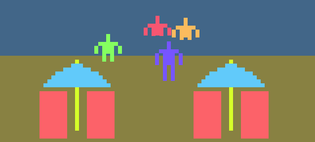

# *Jostle Parent*

## [Play Online](https://www.pippinbarr.com/jostle-parent/web/) (HTML5, not mobile-friendly)
## [Download for Mac](https://github.com/pippinbarr/jostle-parent/releases/tag/mac)
## [Download for Windows](https://github.com/pippinbarr/jostle-parent/releases/tag/windows)

## Description
*Won't someone think of the children!? They need food! They need play! They need not to drown! They need not to be electrocuted! Do something for crying out loud! Jostle them!*

Originally released on 10 April 2015, *Jostle Parent* was made in collaboration with [Unwinnable](http://www.unwinnable.com/) for their [Playable](http://www.unwinnable.com/playable/) project. It was written in [Haxe](http://haxe.org/) using the [HaxeFlixel](http://www.haxeflixel.com/) library. The music and sound effects in Jostle Parent were made with a combination of [bxfr](http://www.bfxr.net/) and [Audacity](http://audacity.sourceforge.net/).

In June of 2022 I was finally able to convince HaxeFlixel to rebuild the game as a browser-friendly HTML5 version (and Mac and Windows releases too). Nice!

## Press
*Jostle Parent* was covered on [Offworld](http://boingboing.net/2015/04/10/play-it-now-jostle-parent.html), [Kotaku](http://kotaku.com/this-game-about-being-a-parent-is-the-most-irritating-g-1697258363), [L&#8217;OUJEVIPO](http://oujevipo.fr/general/4353-jostle-parent/), [Kill Screen](http://killscreendaily.com/articles/jostle-parent/), [Superlevel](http://superlevel.de/spiele/re-jostle-parent/), and [Forest Ambassador](http://forestambassador.com/post/116467134236/jostle-parent-is-a-game-about-shepherding-small).

## Documentation
* Check out the [code repository](https://github.com/pippinbarr/jostle-parent) (includes the original HaxeFlixel project and a new one I've been using to update the exports to HTML5, Mac, and Windows)
* Read the [design journal](../process/journal.md) to get some insight into what I was thinking about while making the game
* Download the [the original .swf file](https://github.com/pippinbarr/jostle-parent/releases/tag/swf/) if you want

## License
*Jostle Parent* is an open source game licensed under a [Creative Commons Attribution-NonCommercial 3.0 Unported License](http://creativecommons.org/licenses/by-nc/3.0/). You can obtain the source code from its [code repository](https://github.com/pippinbarr/jostle-parent/) on GitHub.
