# "Journal"

While making *Jostle Parent* I maintained a journal in Evernote to keep track of my thoughts a little. Here are the entries. Many of these are just lists of things I needed to do or had done. With some reflection about what was going on at the time.

## Jostle Dad design document (5 April 2014)

**Bigger thoughts**

When a child dies you have a funeral and then go to the menu screen and it says “New Game -“ and “New Game - -“ and so on depending on dead kids. Or it says “Continue”. And in the new game that kid is still dead and there’s an empty room. And maybe the kids ask about the kid and so on.

Mostly this is an Octodad kind of a parody (or rather not a parody [of a parody] but a second take on a related idea with a heavier emphasis on tragedy). But for instance the family thing makes me think of Papers, Please so there could be a little post-scene summary of the status of each family members (hungry, dead, etc.).

Once JD is out in crowds and so on he’s going to be able to jostle and get into “fights” and then why wouldn’t he be arrested as in the previous games? (And then: “Your wife bailed you out!” but she would stop after a while and just leave you there) And if he keeps getting arrested then how does that impact the family? Maybe it affects their budget.. so can’t afford things for the kids (like shoes, schoolbooks, etc.) But more generally how does this affect the flow of play? Or should it be the case that starting a brawl just means you “lose” the scene and have to try to complete it again? (But I kind of prefer the feeling that you just get through a scene and whatever happens happens?)

There’s clearly some opportunity to position this as a potential sequel or prequel to Jostle bastard in some funny way, perhaps recommending that they go play the other game to continue… or just linking them across to it…

Should certainly possible to be a Two Dads situation. Maybe we let them specify it or maybe it’s just randomized as to whether your partner is a husband or a wife.

And “colour” wise, just random palettes as per the original I think, although with the kids it’s trickier, because I think it would be cooler if they were always the same colour so you’d know that “the red one” was dead or whatever.

Seems like it shouldn’t be a school day because that sucks the kids away too much and makes you too much less of a “Dad” in the way you should be for the game. So the kids should always be with you, going shopping and so on, to maximise your interactions with them. The only school-thing that would have been kind of cool is  PTA meeting or something, but I can let that one go.

**Logistical thoughts**

The main thing I can do is: make a scene with defined objects some of which can be jostled and some of which cannot. May even make sense to lay them out somehow in a level editor if that’s plausible, just to give me some control over how to do it?

How much “canned” stuff can we afford to have, as that’s effectively the heavy lifting (like the queuing code in JB, for example, or the achievements code, or the rating code… that’s the complex stuff. Don’t need ratings for this one though I don’t think, which is good. But achievements are potentially funny - and Octodad has them)

Child AI? More likely should just have them have a generic “wandering” AI, but then if there are things like falling into some water, don’t want that to happy TOO easily… maybe just have some barriers with a gap they could fall through if you get lucky/unlucky. Similar with the roads… but maybe that’s more just like “well, them’s the breaks”.

**Unwinnable thoughts**

So there’s the whole question of how to integrate this project into the Unwinnable thing now that it turns out that it’s been miraculously funded. The “easiest” thing is that I just have a “secret” blog where I can embed builds, post thoughts and pictures, and so on. And that I just run that from my website and that’s that. The “big” question for me is the question of how I embed the builds nicely. Also don’t want, for instance, a whole page of builds that all then proceed to load at the same time, overwhelming the browser. Could just have one thing per page I suppose but…

All of that is starting to sound like quite a lot of webspace management that I’d rather not do?

So is there a “super simple” approach to it? Well easier would be if the builds lived on their own pages (like any of my games) arranged by date and then the blog just pointed at them with some commentary and a clickable link to play the actual thing which would just sit on a page with no information other than that. And you just hit the back arrow to go… back.

That would work and be pretty simple. So I guess I need to set up a blog? Which… I don’t wanna do?

**Graphics**

How to depict beds? Twin beds? Why don’t they sleep together?

**Levels**

Home - Breakfast in bed

Home - Waking up the kids

Home - Breakfast for the children

Home - Tidying the house

Home - Doing the dishes

Home - Doing the gardening

Home - Fixing the X (plumbing or whatever)

Home - Getting the kids ready for school

Home - Taking out the trash [bag bursts after a while]

Home - quality time with the kids

Home - going to bed at night

Park - At the playground

The Lake/River - going fishing [drowning possibilities for the kids]

Outside home - The school bus

Outside home - Walking to school [maybe]

!! Putting the kids in the car !!

Supermarket - The supermarket

Mall - The mall (with Heavy Rain parody)

Restaurant - Going out to dinner

!! Driving to school/supermarket [maybe not as accidents too severe] !!

Church - Going to church

Church - Funeral for a child

!! Morgue? !!

**Questions about levels**

Are there enough? Home is so dominant because obviously it’s the key domestic space…

**Bits and pieces**

What about the idea of getting dressed in the morning? Probably not because there’s no verb for it, there is only jostle...

## Jostle Bastard structure and Jostle Dad thoughts on that (18 April 2014)

**PhysicsSprite extends FlxSprite**

*color* = Has some colour palette code for replacement between scenes (I remember this being super hairy and I’m glad to think about just not including this at all in the new game)

*kind* = Has an enum saying what kind of object this is - think this was mostly related to tracking specific kinds of jostles. Need to decide whether I include this sort of thing again, probably will I imagine since it feeds into the achievement system and also into reactions potentially…

*dynamic* = tracks whether it’s a dynamic object, I think this just means in the box2D sense.

*hit* = not sure what this is as distinct from the box2D body, but it may be that this is used to feed into the box2D body as specifications?

*body* = the box2D body that basically controls this object in the physics world

*contacts* = a group of the objects currently in contact - I believe this is used mostly for AI to check whether it can move or not.

*depth* = for Y sorting

*lastHitByBastard* = tracking that thing for ricochets etc. I believe

*lastHitBy* = last hit by, for ricochets etc. I believe

*jostled* = a boolean, guess just whether it’s already been jostled?

*lastHitTimer* = this was to avoid a million jostles within a short space of time I think

*speech* = This was when they used to say things

So looking at this I’m reminded of just how elaborate the jostling system was. But maybe we can break it down a bit and think about what is really necessary in terms of what the game needs to actually reflect and know about…

And essentially this hugely boils down to: what cares about jostling?

*Achievements*

Seems like we would like to have achievements in this game, but maybe not on a “per level” basis but rather on a game-wise basis? Which might actually make things a hair easier. Would need to tune how easily they come up though. No achievements for the truly tragic moments? Issue with achievements is how much they trivialize - **is there a way to make achievements themselves tragic?**

But I can imagine yeah just one “furniture hater” achievement that you get after a certain amount of furniture jostling. And a “messy eater” achievement and so on… and these would just build up jostle by jostle solely by checking the “kind” of things jostled. But then also potentially more specialist ones premised on quests for example. So there’s the question of whether there’s some abstract achievements system sitting outside the game code? That gets fed events and stores them. That would make sense I suppose?

So basically the Achievements thing would be an event handler, which would know about particular events and could have them reported and would keep tallies of what’s going on in the game based on that, and then dispatch events or just display event texts on the screen when they triggered.

*AI*

Obviously the AI needs to know about being jostled so that it can react. In JB it was sort of NEUTRAL, FEARFUL, ANNOYED, ANGRY I think? And falling down. And then issues surrounding wandering around or following paths potentially.

This makes me think about the “obvious” problem I think I already hit which is that if you just go wild in public, say, and jostle the crap out of everyone, then you will get into a huge fight and eventually get arrested? Because there can’t be no consequences. But then how does that play into the larger story? Do I worry that people might play, jostle a lot, and then just miss the entirety of the possibilities of the games? I mean, yes maybe, but then fuck them?

Also this raises the specter of jostling children, which is important. Notably your own children. Like quite early one thing you could do is just beat up on your children. And there should be consequences for that. But we also want to distinguish between kind of “sheparding” the children around (which could be the low speed jostle, like the children kinds of “accept” that and it should never injure them except by proxy) and actively smashing into them by holding down the fast button. I mean, that seems reasonable. And obviously “shepherding” other people’s children would result in anger from the parent.

Can I make up some kind of matrix or whatever of jostling and objects/agents (and contexts)?

What happens if you beat up your children at home and nobody sees it? Maybe your partner shows up, attacks you, you go to jail, end of game? But that’s a thing right… is that an “achievement”, can an achievement be written that emphasises how awful that is rather than celebrates it?

*Objects*

Obviously objects “care” about being jostled. By and large this is taken care of by physics though - they just move or don’t move around in the space (and possibly notify the achievements part of the game if there’s an appropriate achievement involved).

Then there might be some “special” objects that have states right, and there’s a big question there about just how complex that’s going to be and how much these are just “one-off” things versus some abstraction…

For example the fridge at the house should be able to be jostled, should open, jostled, things should fall out (maybe over multiple jostles, with achievements - “Got Milk!” etc.) And there are likely other objects like this - perhaps there’s an abstraction for things that have open/closed states and once open are open forever I suppose? Or have a chance of closing? And at any rate if they have items within them then they spawn on jostle once open.

So that could be a “container” that makes sense in potentially multiple locations I’d think. E.g. the supermarket, the house, maybe elsewhere? (Really need to nail down the locations because that will affect that kinds of things I want to be able to include - swing set for example, seems hard to abstract that but I’m so wedded to the idea of the bad father thing…)

But one question that arises is **just how many objects can be out and about before things slow to a crawl?** - need to cap it at some specific level so that that doesn’t ever happen (and may mean it’s best to cordon off separate rooms… like bedroom, kitchen, etc. are all separated from each other, rather than showing a whole “floor” of the house? (And is this an argument for JD being a downloadable game rather than in flash? Like would that allow the physics to scale up a lot more? And do I want to subject myself to that particular brand of bullshit? Because you know that the Windows executable will be a bit painful… although only pre-Win XP or whatever? So maybe it’s acceptable… or rather it just won’t work for XP? I forget, anyway…)

*Specialist Objects*

As above, it feels like you’d probably want some “special” stuff sometimes to increase novelty? Much as I had “interactive” objects in JB like the ability to order stuff? But maybe I even take that away and focus on Jostle as a verb?

In which case let’s say we have a Swing Set? And there’s this idea that a kid gets on it (maybe just through random wandering? Or just as a setup at the park…) and then you jostle them to push them right? And then obviously a hard jostle would knock them off and you’re a bad parent… but then more complex is like, what if you jostle them normally during the swing and at different points during the swing? Suddenly it’s a big fucking pain it your ass… unless you start doing crazy shit with rotation and stuff? And it could so easily break the graphics… but then if you just make it as an animation then you could so easily break the physics… so that’s totally a problem.

First stab would be like, an animation and with each frame it moves an immovable physics object… except that it would probably break physics so, gawd, how awful for me. How awful this life is. OR maybe it’s funny if you can’t actually push them much? Or… argh… see? See how this works?

Like what about the whole question of AN INTERACTIVE WORLD? Like you’re at the park and then how do you show that KIDS ARE PLAYING and so on? Like the slide, the swings, the jungle gym or whatever, how do you make it real, and how do you make it JOSTLEABLE?

Like this is THE BIG PROBLEM. It’s all very well to have an environment, but you need to represent ELEMENTS OF LIFE in order to build the sense of a world and a sense of the children (especially) as real people who do things with their lives beyond wander aimlessly in a space bumping into thing (hilarious though that is).

SO OKAY? CRISISSSSSS.

**On The Purity of Jostling**

Like should it even be possible to do anything except be destructive? Or rather than you can somehow be minimally destructive in such a way as to do kind of minimal parenting?

Like I like the purity of jostle being literally the only verb… and it gets more at the Breakfast in Bed thing which is kind of the tone I want to strike. And in a way Jostle Bastard avoided that element of tragedy by making it possible? Or was the idea there that it enabled the element of tragedy because it was possible to act otherwise? At least one or two people kind of had the tragedy of trying to get along but failing?

BUT

with the concept of micro-goals [or whatever] (ala Octodad) I think the tragedy comes back in with the singular verb because you’re basically being asked to do something reasonable that you then can’t do because of the mechanics, but the mechanics are reasonable because *that’s who you are*, and *that is the tragedy. SO FUCK YOU!*

No, I mean, you’re fine, we’re fine, but I found that pretty compelling when I typed it. Wonder if that will last.

## Jostle Dad Big Questions (née Crises) (18 April 2014)

(Was called Crises but Not really crises but more like THE BIG QUESTIONS.)

**Tasks / goals**

Each scene will be broken into tasks/goals - how will these actually be judged? Most of them, presumably, will be impossible - or a lot of them, e.g. making breakfast in bed won’t work because you can’t do that. Only things that can be accomplished by jostling stand some sort of change.

Once option is to have them on a time so it’s just emphasized how futile the whole thing is, but then some of them might be “needed” to complete a level, like getting the kids out of the house by jostling them through the door for example. And you’d need some kind of “kid counter” such that when you got them close to the door (or they wandered there) they’d walk out and it would tick them off. Would need to look at the kinds of goals that would make sense and give context to the environment… some of them might be jostle-ready (e.g. pushing on a swing kind of makes some sense) and others might be part achievable (e.g. at a supermarket you might be able to jostle a product off the shelf and then even kick it all the way to checkout, but you ultimately wouldn’t be able to actually buy it? There’s that question of whether the checkout person would somehow magically sell it to you? But I don’t think that makes any sense…)

**Pre-narrative**

Big annoying question - how has Jostle Dad got THIS FAR? It doesn’t make any sense if he’s this hopeless and can’t even make the kids breakfast or do anything at all other than jostle. Unless normally he has a jostling job that brings home the bacon and he’s a bit useless and only really spends QT with the kids on the weekends, so that’s why they’re still alive (and the game should be doable, so it’s not like they would definitely be dead). Maybe he’s a bouncer normally and this is his day off or whatever, or he’s like a cop, or whatever, doesn’t really matter? Though could hint at history - fucked up breakfast in bed AGAIN, for example.

So it’s that mostly the partner has been taking care of the kids, and this is “your day” to look after them and do fun things. Partner maybe doesn’t even come out on this day, it’s just up to you.

**Interactive Objects / Living Agents**

While it’s possible to think about certain classes of object that are okay to implement, e.g. containers that open and emit items on jostling, there are a lot of “specialist” interactive objects that are much harder to conceive of and implement.

It’s clear that we want to be able to have a world in which the agents (e.g. your children, other people) are going about “normal” lives - sitting down, queuing for things, moving around aimlessly [but with the interpretation that it’s “aimful”], and so on.

But there are more complex activities implied by certain environments that are a problem. The swing set in the playground is an obvious example. Say that a kid that wanders nearby get onto the swing and then needs a push (or can even move on itself). How does the Dad do the pushing, what is the physics of this? Wow I just had an idea for that specific case [that you have a horizontally moving object rather than a rotating one and set the animation frame based on its position! Although I bet there are hidden hongs in there!] but the general case is still problematic.

These more “flair” interactions are maybe super important because they ground the game more in reality, and the reality grounds the tragedy. And crucially there are certain actions that *can* be achieved with a jostle-like motion [like the swing set], and we want those because they help us to think about the tragedy of other actions that can’t be performed. (I should really look up the definition of tragedy.)

So given that they are kind of, by definition, “weird” or “distinct” in the world of the game, it’s kind of like each one just has to be created individually and that’s just a cost of doing business and having something more interesting? Maybe each scene can have one or two (or whatever seems appropriate).

But yeah, the specialist objects are easily the highest “cost” in the game because it’s just just creating a scene and putting the player in it with tasks.

So basically need to nail down the scenes and then look at what the specialist objects in them are...

**What are the scenes?**

This is obviously, like, pretty important, but it may be easier if we’re thinking more in terms of “rooms” or individual spaces rather than something like “the house” because that makes it more reasonable to have distinct “missions”. And in fact what actually happens in Octodad in a level? You kind of “complete” it and then it goes to a new level right, so there’s no sense of an open world per se, which may make my life a lot easier. (Can you fail? What happens? Watch a Let’s Play.)

Okay so let’s try (and ask Rilla):

Bedroom - Get up, shower

Kids rooms - Wake up the kids, get them downstairs

Kitchen - Make breakfast

Living room - Tidy up

Back yard - Hang up the washing

XXX room - Pack up for a day out?

Front of house - get the kids into the car

?? Church - listen to the service quietly / get the kids into their seats

Playground - Play with the kids

Wharf/lake - Go fishing with the kids

Woods - going for a walk (kids can get lost in the woods)

Mall - Go shopping with the kids? Find the kids?

Supermarket - Do the shopping [go to indicated aisles, then I guess jostle the objects off and not be able to buy them?]

Front of house - get the kids into the house

Kitchen - make dinner

Kids rooms - put the kids to bed

Living room - Tidy up [or even all the rooms?]

Bedroom - go to bed

Church - child’s funeral

Jail - serve hard time

[Aquarium - that would be kind of funny in reference to Octodad but maybe a bit much to actually do. And better to keep it more prosaic I think.]

[Funny reference might be that you can’t swim? So you could die by going into the water to save your child for instance… but what would that mean in terms of replay? Is it a hard reset on death, or just a checkpoint reset as with Octodad - and yet this checkpoint resets don’t apply to dead children. But maybe that’s kind of nice?]

**What is the timeframe?**

By this I mean does the game just take place over a single day? And is it always the same dad? Like just a Sunday for instance? Or do we want it to take place over contiguous days? Referring to Octodad is fine - that seems to just happen on one day, so that would fit perfectly well. And it’s a day when you go out with the kids, so that’s good too.

Okay the game takes place on a Sunday.

**Interactions with the kids**

The kids are special because they’re your kids and so it seems like they ought to have behaviours. Like in the mall for instance it would make sense that when (if) you find them they start to follow you?

So obvious kid things:

\* Meander (this would be the default annoying behaviour)

\* Follow dad (this could be a specialist behaviour)

\* Meander close to dad (this might make sense, but I think it’s better maybe if they’re just totally hopeless and will walk anywhere? But they should be [relatively] slow so that you have a shot at preventing things like them going onto the road and so on…)

**Achievements**

It’s fine to *have* achievements obviously, and then it becomes a question of what we track and how specifically and how we notify the player of them and show them. I think it’s a legit question as to whether we even have them in the first place, still need to think about that. They may cheapen things and to have “good ones” may ultimately just be too complex in the first place potentially… need to think about an “achievement language” almost that would simplify things down… one option is just what got jostled and how, of course. Another is that with the tasks assigned there could be achievements based on variants of achieving them… but of course in this game you *can’t* achieve most of them so maybe it’s a bit pointless? Don’t want a half-assed element in the game…

Okay maybe no achievements? Is that where we’re headed potentially?

## Jostle Dad Design Document (23 April 2014)

**General**

**Sound**

Maybe some kind of procedural “melody” thing this time for a kind of moderately cheery vibe?

 Menu

Title of the game

Either just says NEW GAME if they’re not playing (or recently went to jail indefinitely, or all their children died).

Or CONTINUE if there’s a game in progress. No way to reset other than that.

**Home [morning]**

Death by: none / lawnmower?

Rooms: JD bedroom, bathroom, kids rooms * 2 (one double, one single), living room, kitchen/dining, back yard

Possible goals:

   shower [jostle tap],

   make breakfast in bed for partner [impossible],

   wake up the kids [jostle them],

   make breakfast for the kids [impossible]

   mow the lawn [jostle the lawnmower around the yard, could kill children with it?]

   get the kids outside to leave [jostle them]

**Front yard [morning]**

Death by: hit by car

Possible goals:

   Open the back door,

   Get the kids in the car (just close enough to the door opening)

**Playground**

Death by: falling off the top of the slide [issue that this would kill other kids too and if you kill someone else’s kid then that would be kind of game over? kids wandering off out of the park?

Possible goals:

   Push kid on the swings,

   Seesaw,

   Watch kids play - make sure they don’t get lost,

**Fishing / At the beach?**

Death by: Drowning, wandering off

Possible goals:

   Supervise kids - make sure they don’t drown,

   Buy icecream [impossible, just knock it on the ground],

**Supermarket**

Death by: Something heavy falling on head?

Possible goals:

   Obtain multiple items on shopping list [jostling the shelves indicated, kicking the things along]

   Check out [impossible]

**Home [evening]**

Death by: catching on fire at fireplace?

Possible goals:

   Tidy the house [impossible],

   Make dinner [impossible],

   Make kid X do homework [jostle them into it],

   Put the kids to bed [jostle them there],

   Brush teeth [impossible]

   Go to bed

**Church [funeral]**

Death by: none

No goals, just sit through the service.

**Jail [holding cell]**

Death by: none

Wife will bail you out the first two times, the third time you stay in there forever, or maybe cut to you in a solitary cell instead of in a holding cell. Game over.

Possible extra scene after bail out of recrimination, sad household, before it cuts back to the next Sunday.

No goals, just sit in the cell.

**Endings / Big game events**

Child dies —> funeral —> continue menu OR empty house game over

Child goes missing —> milk carton —> menu OR empty house game over

You go to jail —> [[ jail + bail + miserable night —> menu ]] OR eternal jail —> Game Over

All children dead or missing —> empty house, broken marriage —> Game Over

Divorce? e.g. if you abuse your children ‘too much’ you get arrested and for this kind of thing you only get one strike maybe? Empty house, broken marriage —> Game Over

I like the idea of a “live” game over, so you’re just in the empty house and you can walk around it, but there’s “game over” on the screen the whole time with an option to try again, which takes you back to the menu and a “New Game” option. Or alternatively it tells you to come back in N (=24? =1?) hours when a New Game will be available again.

## Jostle Dad: The Return of the Guy Who Is Supposed to Make It (24 June 2014)

Really this is just a glorified diary entry on the occasion of returning to thinking about this game. I just re-read all my notes and design documents and still essentially agree with them.

It may in fact be time just to make a tiny little simulation of kid shepherding rather than continue to think about the hard problems. I.e. make a square region, have the dad and the kids, and keep the kids on the square, and see how hard that is. And that’s totally it (I’m reminded of that game about the kid who goes out on adventures now, so maybe I should play that again in a second - if I ever remember what it was called/how to find it - I’ve asked Twitter). And then there are more “tech” tests of constructing environments from the game, for instance, and looking up things like texture atlases and so on and whether I need those or not - probably not? (Given that flash bundles everything anyway and for all I know does something like that anyway.)

So yes, making a little thing would probably help a lot, and especially kid shepherding since that’s the “feeling” I most want to catch that’s distinct from Jostle Bastard.

Still worrying that there are things about this game that I won’t be able to do and that are kind of “nonnegotiable” in terms of hitting the affect I’m interested in. e.g. just setting enough of a scene, and dealing with player idiocy. Fucking players.

Desperately want the game not to get too big. Want to just be able to make it without dying from learning some new shitty thing, or from having to implement something that there’s actually a simple solution to but which I don’t fucking get.

What about killing other kids and other people? THAT IS AN ISSUE.

## Jostle Parent : Fresh Thoughts / Big Plans (17 July 2014)

The idea is to sit my ass down in this chair and make a plan of every single scene in the game (including inventing/cutting them as necessary) and to decide one what’s going to happen.

Point: the entire game can be viewed as a series of “levels” in which you practice the single mechanic of maintaining some objects (kids) in a safe zone while avoiding hazards (other people, etc.) and occasionally performing “special moves” (probably?)

**MECHANIC SEMANTICS**

Point: in what ways can one use the basic mechanics?

\* Jostle kids to a specific location

​     Table, bus

\* Jostle kids away from a specific location

​     “Lost”, water, road

\* Jostle something to/away from a specific location (avoiding the kids)

​     Lawnmower

\* Jostle something to the kids

​     Icecream

\* Jostle something away from the kids

​     Dog,

Some way of always having one “normal” task and one “death prevention” task to encourage split attention? Sending text messages?

**PRE-GAME**

Do we need some way of giving a narrative setting? E.g. that you’re a person who can only jostle etc.? That this is your special day of looking after the kids?

**THE GAME AS A SEQUENCE OF GOALS IN PLACES**

**GOAL: GET UP**

\* PLACE: Home / bedroom

\* ACTION: Just hit any of the movement keys to get out of the bed

\* TUTORIAL: This could tell you how to move around the room

\* TUTORIAL: Warning about home hazards (electrocution)

\* NEW CODE: ability to display GOAL TEXT

\* NEW CODE: ability to display TUTORIAL TEXT / DIALOG

**GOAL: SHOWER**

\* PLACE: Home / bedroom

\* ACTION: Walk into the shower and hard-jostle the shower on/off

\* TUTORIAL: This could be the tutorial bit for jostle/hard jostle

**GOAL: WAKE UP THE KIDS**

\* PLACE: Home / kids’ room

\* ACTION: Jostle their beds to get them up (hard jostle vs. soft?)

**GOAL: GET SOME BREAKFAST OUT OF THE FRIDGE**

**GOAL: FEED THE KIDS**

\* PLACE: Home / kitchen

\* ACTION: Jostle the fridge/cupboards to eject food

\* ACTION: Jostle the food to the kids or the kids to the food

\* ACTION: Take the kids to the back yard to play while you mow the lawn

\* **DANGER**: Choking

**GOAL: TAKE THE KIDS TO THE GARDEN**

**GOAL: MOW THE LAWN**

**GOAL: TAKE THE KIDS INSIDE**

\* PLACE: Home / back yard

\* ACTION: Jostle the lawnmower around until the lawn is mowed

\* ACTION: Get the kids back inside

\* **DANGER**: Pesticide

**GOAL: GET THE KIDS OUTSIDE**

\* PLACE: Home

\* ACTION: Jostle the kids to the front door

\* **DANGER**: Choking

**GOAL: GET THE KIDS ON THE BUS**

\* PLACE: Street

\* ACTION: Wait for the bus

\* ACTION: Jostle the kids to the doors

\* **DANGER**: Hit by car / bus

**GOAL: MAKE SURE THE KIDS DON’T WANDER OFF**

\* PLACE: Park / play area

\* ACTION: Jostle the kids away from the edges of the screen

\* **DANGER**: Lost and abducted

**GOAL: GO FOR A WALK**

**GOAL: KEEP THE DOG AWAY FROM YOUR CHILDREN UNTIL ITS OWNER COMES BACK**

\* PLACE: Walking path

\* ACTION: Jostle the dog away from the kids (who will move slowly away from it?)

\* **DANGER**: Dog gets a kid and mauls them to death

**GOAL: APPRECIATE THE VIEW**

\* PLACE: Cliff top

\* ACTION: Jostle the kids away from the edge of the cliff so they don’t fall to their death

\* **DANGER**: Death by falling

**GOAL: ENJOY THE POOLSIDE / BEACH**

**GOAL: MAKE SURE THE KIDS DON’T GO TOO DEEP**

\* PLACE: Swimming pool / beach

\* ACTION: Jostle the kids away from deep water

(Could be in a pool and just happens at times, so have to wade in and push them to a ladder before they drown - they could start thrashing. Maybe you should have another simultaneous task that gets points of some kind?)

\* **DANGER**: Drowning

**GOAL: GET THE KIDS INSIDE**

\* PLACE: Outside house after got off bus

\* ACTION: Jostle kids back to the front door

\* **DANGER**: Hit by car

**GOAL: MAKE THE KIDS DO THEIR HOMEWORK**

\* PLACE: Home / Living room / dining room

\* ACTION: Jostle kids to the table where they do homework

\* **DANGER**: Choking [from breakfast food on floor]

\* **DANGER**: Electrocution [Faulty wiring in socket]

**GOAL: GET DINNER FROM THE FRIDGE**

**GOAL: FEED THE KIDS DINNER**

**GOAL: STOP CHILD X FROM CHOKING**

\* PLACE: Kitchen / dining room

\* ACTION: Jostle the fridge for dinner

\* ACTION: Jostle the food to the kids or the kids to the food

\* ACTION: Hard jostle choking kid

\* **DANGER**: Choking

\* **DANGER**: Electrocution

**GOAL: PUT THE KIDS TO BED**

\* PLACE: Home / kids’ room

\* ACTION: Jostle the kids to their room

\* ACTION: Jostle the kids against their (correct) beds

\* **DANGER**: Choking

\* **DANGER**: Electrocution

**GOAL: GO TO BED**

\* PLACE: Home / bedroom

\* ACTION: Go to your room and go to the bed

**CURRENT DEATHS**

[Choking on toy in bedroom?]

[Eating pills in bathroom?]

Choking on food in kitchen

Eating pesticide in garden

Hit by car outside house

Lost in park

Mauled by dog

Drowned in pool / at beach

Electrocuted in living room

[Falling off… what?]

**CURRENT PLACES**

Bedroom

Hallway

kids’ room

Main bathroom

Kitchen/living room

Back yard

Front yard/street

Park

Path

Cliff(?)

Pool/beach

**SUMMARY OF KEY ACTIVITIES**

Mow the lawn (don’t hit the kids)

Get the kids on the bus (don’t let them get hit by a car)

Enjoy the park (don’t let the kids wander off) [Timer]

Something about drowning

Something about shopping

Keep the kids away from the fire

Put the kids to bed

JOSTLE KIDS AWAY FROM X

JOSTLE KIDS TOWARD X

JOSTLE X AWAY FROM KIDS

JOSTLE X TOWARD KIDS

JOSTLE X AWAY FROM Y

JOSTLE X TOWARDS Y

JOSTLE X [to cause something to happen]

## Update on the thoughts about the Jostle and the Parent (8 September 2014)

OK.

**Responses to myself in bold. Like this.**

Well shit. I’ve been avoiding it a bit and, looking at it now, I think it’s because it’s at a point where it’s sort of semi-feature complete in the apartment in that you can do all the basic tasks and the game knows and the kids can die of choking or electrocution or poison in the yard.

**Yeah.**

So there are two obvious things that should probably happen now?

\* Code refactor – it’s starting to feel like a HUGE MESS at this point with lots of hacky fixes and I wonder whether it would be smart to comb through and just “make sure” it works etc. at this point before I add a whole shitload more and before I try to do the next thing, which might benefit from refactoring, and which is

**I totally did this. Or at least, I broke out all the locations into separate classes that handle themselves now and so the PlayState file is much, much more manageable. I did this by using shitloads of static variables etc. though so it’s not exactly “clean”. But fuck that right?**

\* Polish – now having a full “section” of the game (it’s quite a bit of it really at this point) it would probably make sense to bring the whole thing up to a final-ish level of polish so that the interface elements are there etc. and you can play all the way through to getting the kids outside complete with tutorial elements, message boxes, task texts, help texts, and so on.

**This is really the next thing. Need to work out what the UI stuff is because that’s basically where it’s at at this point. Need little boxes to come up that handle “tasks” (which will double as tutorial at the beginning). And then little boxes that show kid status when they’re in trouble (e.g. choking, swallowing poison, being electrocuted, so that you can save them). All of these can literally just be white text on black - the tasks should appear somewhere peripheral (top right, say) and the kid texts should appear directly over their heads and flash to indicate importance. (And at least the first time you should also get a “task” associated with the kid saying you need to “hard jostle” them in order to save them.)**

And there are a couple of decisions to make about things like child abuse - like what happens if you just smack the shit out of one of the kids? That probably shouldn’t be allowed right? But what to do if they keep doing it? “You killed your own child” would be the obvious one. But they’d need some sort of warning about it I think. Like you knock them down and get a warning to be careful/not too rough, and then if you keep going from there then at some point they die or you just get arrested? (These are the little complications I kind of want to avoid… but they’re important.)

**Child abuse is a serious issue. (Ha ha, yes, funny to write that.)  But yes, it’s a thing. I think it needs to be another “task” thing maybe the first time you do it and knock them to the ground - like “watch it! You can’t just go shoving your children around like that! And they fall down in a heap. And then get up (and maybe are afraid for a while?). And then if you knock down any other child it’s game over? (But what about when you’re “saving” them? That’s just a special exception? I guess so. “There was no need for that!”) And if you shove them down again (in a non-needed context) they die and you’re in jail and that’s the end of the game.**

The big code shitter is just handling EVERYTHING inside the one giant file for maintaining the game state. Which is good in some ways and not so good in others.

**I fixed it now. Well, I tried.**

## Jostle Parent Dev Todos (25 September 2014)

**Uh,**

I’m more than a little perplexed at the moment because I’m really quite sure that I had written an updated todo list quite recently, just before going to Cologne, and now it just doesn’t seem to exist at all. So I’m going to do it again because I had quite a tidy little list of things to do all nicely laid out. I’ll do it again.

**Task UI**

\* ~~Add general ability to display a task at top-right (or somewhere) in white on black background (sized according to length of the text, look at other games for reminders on how to do this).~~

\* ~~Add indication of a task being completed (e.g. crossed out, a tick, something)~~

\* ~~Add tweening-in and out of tasks (slide in from side, say)~~

**Tutorial UI**

\* ~~Add general ability to display a tutorial element bottom-left (or somewhere) in white on black background (sized according to length of the text)~~

\* ~~Add fade-out of a tutorial element that has been “succeeded” at.~~

\* ~~Think about how you trigger and dismiss tutorial elements~~

**Danger UI**

\* ~~Make the word appear in white on black box centred above the child’s head and flashing~~

**Interactions with children**

\* ~~Add a knocked-down frame to child sheet~~

\* ~~Add a “waving for attention” frame to child sheet~~

\* ~~Hard-jostle always knocks a child down~~

\* Knock-down always has a (pretty high) chance of killing child (with the exception of the first time, when you can’t kill them) and otherwise they get up

\* (Killing a child sends you to jail.)

\* Make choking quite unlikely (it’s the one thing you can’t prevent)

\* Make them freeze to the spot if electrocuting? (electrocuting has been a bit of a pain so far.)

**Shower**

\* ~~Fix it so that shower stays on for a while after first jostle~~

**OMG**

\* Remember you need variable checks for numbers of children

**Thing**: Sketching further scenes for the game outside.

## Jostle Parent Development List (2014-10-10)

**Interactions with children**

\* ~~Knock-down always has a (pretty high) chance of killing child (with the exception of the first time, when you can’t kill them) and otherwise they get up~~

\* ~~Make them freeze to the spot if electrocuting? (electrocuting has been a bit of a pain so far.)~~

\* ~~Work out how to make them mobile again post hit, because right now it crashes for some reason~~

\* ~~Make choking quite unlikely (it’s the one thing you can’t prevent)~~

\* ~~Alternating the children between aimless wandering and following, so that there’s more of a personality?~~

 ~~(Also weird that you have to knock them *into* something to knock them down, though maybe that’s okay - allows for the risk of sweeping them around at speed)~~

\* Killing a child sends you to jail.

   \* ~~Get jail from Jostle Bastard~~

   \* ~~Implement jail~~

   \* ~~Implement kill child->jail~~

\* Play around with making knockdowns FEEL a bit more interesting?… right now they feel quite “light” perhaps?

**Child death**

\* ~~Implement some kind of state or other way for the game to notice child death and transition~~

\* ~~Fade out the screen (actually we can go to a brand new state because we don’t need to worry about remaking the world - oh except for the mess… so maybe we do… think about this) - need another group that can sit on top of everything for fade-outs and ins.~~

\* ~~Sketch graveside~~

\* ~~Implement basic graveside~~

\* ~~Handle multiple child deaths? I guess you can check if there are any “mortal threats” in action on one child’s death and only resolve death when they’re all done. (But could this lead to all children dying at once?!)~~

\* ~~Display text about how the child died (means writing their reason for death somewhere)~~

\* ~~Implement number of gravestones based on number of dead kids (requires death implementation)~~

\* ~~Implement ability to leave (have the kids follow you)~~

\* Restart the game (but keep the mess!)

**Child state**

\* ~~It’s getting too complicated. Think about how to track and display state more nicelier. The “obvious” thing would be a prioritized list of problems - e.g. electrocution supersedes hungry. But once the electrocution stopped they’re hungry again? (That would need to be in the update loop? Ugh.)~~

**Overall control**

\* Remember you need variable checks for numbers of children

**Menu**

\* ~~Make the menu come up after you leave the graveyard~~

\* Make a menu that lets you play (really it would only ever have “NEW GAME” and “CONTINUE”? and a title

**Save states**

\* Oh god do we need to be able to save everything like

   \* Number of children dead?

   \* Physical state of all rooms/objects?

   \* Where the player was up to in the task list?

   \* State of the children (maybe not, just reset to task default?)

   \* (Maybe it’s not so bad? It’s also something to add AT THE END)

**More**

\* ~~Add y-sorting~~

\* ~~Create a superclass for sorting (e.g. PhysicsSprite to inherit from it and any other FlxSprites, because we need to sort by hit y for physics sprites and not sprite y)~~

\* ~~Sketching further scenes for the game outside.~~

## Jostle Parent More Thoughts (7 August 2014)

So I said to myself that once I had “built out” the apartment rooms and implemented teleportation between rooms (in principle) I would then lean back in my chair and think about what needs to be done next in order to continue the game At A Good Clip.

~~**Thing**: An obvious thing is to add the rest of the doors to the apartment now that it actually clearly works.~~

~~**Thing**: Add kids to the kids room and allow them to wander around but not allow them to go through doors at will. (This actually sounds a bit complex I’m now realizing?! Like how do you stop them from leaving when they walk around randomly?) (And if you let them leave it seems like it could be super easy for them to die while unsupervised?!!!! Or is that okay?) (First implementation is, I guess, that they just pass through doors normally.)~~

~~**Thing**: Contemplate the issue of how to get kids through doors - push only would kind of make sense, in which case need to reimplement the concept of having been pushed. And have doors check whether the kid was pushed into them or just walked into them and respond appropriately… hm.~~

~~**Thing**: What should kids do when they’ve moved through a door? Just wait on the other side? Seems to me they should just continue on - like, you shouldn’t just let the kid wander off and it’s not going to WAIT for you, except in very special circumstances? Like maybe the transition to the outside? But even then… look after your kids!!~~

~~**Thing**: Be able to shepherd the kids around the house successfully.~~

~~**Thing**: Work out how to implement lawn mowing - mostly a question of laying FlxSprites over the lawn that can then be removed by the lawnmower when it overlaps them.~~

~~**Thing**: Make the lawn nice (what the fuck about the kids wandering back into the house while you’re outside? Guess you can just consider the door “locked”?~~

~~**Thing**: Maybe change kids to stay still for a while after you impact them… some random timer amount so that you can manage them a bit better, like they “go limp” for a bit. Don’t explain, maybe, this is just behaviour they exhibit… they could also have personalities… one a bit more adventurous etc.~~

~~**Thing**: Implement the whole “container” idea for some objects such that they can emit “things” into the scene when jostled hard enough. (Is this literally only the fridge?)~~

~~**Thing**: Implement an “impatient” stage for the kids before they start walking around again.~~

~~**Thing**: Implement “get the kids out of bed” through a hard jostle (similar to the container thing now I think about it, but it can be separate).~~

~~**Thing**: Implement kids “eating” food if it knocks into them (but not if they knock into it? (or both?))~~

~~**Thing**: Figure out why children no longer go through doors apparently!! WTF?~~

~~**Thing**: Need some kind of “task” subsystem that tracks when you’ve done “things”? Just an ENUM of tasks needed? Or… what?~~

~~**Thing**: Implement the game noticing when you’ve taken a shower.~~

~~**Thing**: Implement the game noticing when the kids are out of bed.~~

~~**Thing**: Implement the game noticing when all the grass has been mowed.~~

~~**Thing**: Implementing the concept of goals/tasks that can be active and that can be detected as having been completed by the jostler.~~

~~**Thing**: Implement the game noticing when the kids have been fed.~~

~~**Thing**: Implement the game knowing when people are in a particular room~~

~~**Thing**: Implementing indicating the current task for the parent~~

~~**Thing**: Implement garden door being “locked” until you finished mowing the lawn.~~

~~**Thing**: Implement front door being “locked” until it’s time to actually go out.~~

~~**Thing**: Implement hunger as an alpha value!!~~

~~**Thing**: Implement possible choking by a kid (plus ability to jostle them and “dislodge” the food.~~

~~**Thing**: Implement electrocution in terms of timers etc. (Think about smarter ways to handle multiple timers [e.g. electrocution while choking?!])~~

~~**Thing**: Implement a basic notification box above children’s heads that tells you about their choking, electrocution, etc.~~

**Thing**: Implementing ability to kill children if you slam them too much… warning about it first few times, then it starts to injure them. Maybe count some number of hard jostles over set time periods? Or maybe even just if you hard jostle them they fall down? (But what about choking?) And should children be hard to shift when electrocuting? E.g. need to jostle them then?

**Thing**: Sketching further scenes for the game outside.

**UNSOLVED AND MAYBE UNSOLVABLE AND MAYBE FUCK IT**

**Thing**: What happens when someone blocks a door with some piece of furniture that then won’t move? Which is totally possible by the way. **Fuck**.

**Same Thing**: Lawnmower can totally get completely stuck in the corner, really unclear on how to fix that problem because it’s the same thing as the furniture problem. Needs a solution.

**Idea**: Destructible furniture that breaks apart with enough hard jostles applied to it. If it can move, it should be destructible, basically. Conceptually speaking, it’s fair for him to get stuck behind a couch in front of a door because all he can do is jostle it (push it). Need to specify some number of particles. Need to have particles specific to different colour types.

**But**: This idea won’t work for the lawnmower…

**Thing**: Will it be possible to not be able to get a kid out of a room because you can get past them because of furniture etc.??!?!?!?!?!?!? Will destructible furniture fix this? What about if they go into the bathroom and won’t come out? Not much room in there… stupid fucking dynamic systems.

**Thing**: Thinking about that idea of goals like “tidy up” and so on, the concept of impossible tasks and what that would mean, or whether those are really needed because it’s just kind of obvious already that it’s a mess and it would be enough that the mess is still there when you return home? Yeah I mean, I’m kind of thinking about dropping everything like that, because it can just be “shown” by the game and does need to be interfaced...

## Jostle Parent Physics Problems (19 August 2014)

There are physics problems.

Specifically it is possible to “wedge” objects against walls (and each other) such that they’re perfectly aligned and can no longer be “bounced” off that surface. Which is fucking annoying when it happens, even though it’s not the “point” of the game. Some of it is fixed by reducing/removing friction and thus letting you “drag” objects by sliding along them with the jostler bastard.

But there are two major problems still:

1/ It’s possible to block a doorway such that it’s either impossible to free up or such that it would take forever with fiddly movements to free up. Meaning you can get stuck in a room or can prevent access to a room you need to get into for the game.

2/ It’s possible to wedge a key item like the lawnmower in a corner and thus no longer be able to use it easily, making it impossible to complete a goal for instance.

“Solutions”

1/ See if there is some way to make furniture always repel from walls and each other such that they would never be perfectly aligned. I have some suspicion that this isn’t possible and even that it’s somehow reducible to exactly the same problem anyway.

2/ Fix all the furniture in place so that it never moves. This may be annoying in terms of navigation and perhaps worse it doesn’t allow for “mess” which is a sort of central part of the idea of the game - that there’s entropy and things devolve into a more and more chaotic state, reflecting your abilities as a parent, particularly in the home.

3/ Don’t give a shit and if someone manages to seal themselves in a room or “lose” the lawnmower then fuck ‘em. I want to believe this is okay and that I could maybe tweak the “weight” of objects and so on sufficiently that this wouldn’t come up at random, but I just don’t know. Like maybe if everything is heavy enough that you *can* mess it up, but it would be an effort to block the doors rather than something that happens easily by mistake? And then rely on things like the food on the floor or toys on the floor in the bedroom as ways to mess up the house without causing so much trouble?

 Further to all this, moving the children themselves around is similarly painful because of the physics and furniture and room shapes because it’s possible for them to go into places that you basically then can’t get them out of properly, which is insanely annoying. The point of the game is of course meant to be somewhat annoying, but I’m worried that it’s SO annoying that it won’t actually make its point.

**FOR NOW**

Make the furniture heavy (especially anything that can manage to block the door “easily”. Then fix the child “AI” so that they’re less fucking annoying. And so that if you bump them they stay put for some amount of time. Also see what it’s like to vary their speed a bit sometimes? Like the “run” sometimes? Also why do they fucking walk into things? Fuck you, children, fuck you.

What if the children moved with you within reason while in your “area”? Or would that.. no I think that would make them annoying in a bad way. Okay forget I said that.

## Jostle Parent Development List (10 October 2014)

**Interactions with children**

\* Knock-down always has a (pretty high) chance of killing child (with the exception of the first time, when you can’t kill them) and otherwise they get up

\* Make them freeze to the spot if electrocuting? (electrocuting has been a bit of a pain so far.)

\* Work out how to make them mobile again post hit, because right now it crashes for some reason

\* Make choking quite unlikely (it’s the one thing you can’t prevent)

\* Alternating the children between aimless wandering and following, so that there’s more of a personality?

 (Also weird that you have to knock them *into* something to knock them down, though maybe that’s okay - allows for the risk of sweeping them around at speed)

\* Killing a child sends you to jail.

   \* Get jail from Jostle Bastard

   \* Implement jail

   \* Implement kill child->jail

\* Play around with making knockdowns FEEL a bit more interesting?… right now they feel quite “light” perhaps?

**Child death**

\* Implement some kind of state or other way for the game to notice child death and transition

\* Fade out the screen (actually we can go to a brand new state because we don’t need to worry about remaking the world - oh except for the mess… so maybe we do… think about this) - need another group that can sit on top of everything for fade-outs and ins.

\* Sketch graveside

\* Implement basic graveside

\* Handle multiple child deaths? I guess you can check if there are any “mortal threats” in action on one child’s death and only resolve death when they’re all done. (But could this lead to all children dying at once?!)

\* Display text about how the child died (means writing their reason for death somewhere)

\* Implement number of gravestones based on number of dead kids (requires death implementation)

\* Implement ability to leave (have the kids follow you)

\* Restart the game (but keep the mess!)

**Child state**

\* It’s getting too complicated. Think about how to track and display state more nicelier. The “obvious” thing would be a prioritized list of problems - e.g. electrocution supersedes hungry. But once the electrocution stopped they’re hungry again? (That would need to be in the update loop? Ugh.)

**Overall control**

\* Remember you need variable checks for numbers of children

**Menu**

\* Make the menu come up after you leave the graveyard

\* Make a menu that lets you play (really it would only ever have “NEW GAME” and “CONTINUE”? and a title

**Save states**

\* Oh god do we need to be able to save everything like

   \* Number of children dead?

   \* Physical state of all rooms/objects?

   \* Where the player was up to in the task list?

   \* State of the children (maybe not, just reset to task default?)

   \* (Maybe it’s not so bad? It’s also something to add AT THE END)

**More**

\* Add y-sorting

\* Create a superclass for sorting (e.g. PhysicsSprite to inherit from it and any other FlxSprites, because we need to sort by hit y for physics sprites and not sprite y)

\* Sketching further scenes for the game outside.

## Jostle Parent Development List (21 October 2014)

Interactions with children
* ~~BUG: Kids don’t seem to pause on contact anymore~~
* Play around with making knockdowns FEEL a bit more interesting? (Right now they feel quite “light” perhaps? Restitution?)

Child death
* Restart the game (but keep the mess!)

Child state!

Overall control
* Remember you need variable checks for numbers of children

States
* ~~Get the basic idea of being able to “restart” the game going (e.g. just so it doesn’t explode)~~
* Get the idea of a restart that incorporates saved states

Main Menu
* ~~Make a menu that lets you play (really it would only ever have “NEW GAME” and “CONTINUE”? and a title~~

Save states
* Set up saving to FlxG.save (looks relatively “easy”…)

More
* Sketching further scenes for the game outside.

## RESTART (25 October 2014)

Okay.

Here’s the main thing. Let’s rewrite all the code with proper practice, and with our new knowledge of a bunch of the stuff that needs to happen. In particular, let’s avoid weird static variables all over the place if at all possible? (Even though there are still a bunch of basic issues like sprites with two sprites in them… hm.

The main thing that has been losing me is state control, I guess. And saving.

Hmm hmmm.

This is not sounding very inspiring of confidence.

—

OKAY.

Well I’ve now re-made the game in at least a bit more organised fashion and have it all the way to a Parent walking around in all the environments I’ve made to date. So that just leaves the hard bits.

I’m thinking that I just handle Tasks in the PlayState… as in, each task is just a state of the PlayState, since only one can be active at any time… no real need for them to be elsewhere? So I think (THINK) that will work. The other big question is just stuff like handling the children and handling saving.

Saving locations of objects can, I think, be handled by Places… that is you save a Place and that saves the locations of all saveable objects. And then when you make a new place it will check whether there is a saved location and place the object there and otherwise at its default position. It will make for bigger code in Places, but it should at least actually work.

The other question is WHEN do you save. And we feel the answer to this is on State switch basically. i.e. if a child dies, if you finish a task, if you go to jail.

So maybe I implement Place saving right now.

## HHHHHHERE WE GO! AGAIN EDITION! TODOS! (7 November 2014)

**General startup**

Implement ability to start at any task (will need this for cookieing anyway)

**General UI**

Implement basic idea of tasks and completions

Implement basic ability to display text nicely on the screen

Implement UI tweens

Work out how to do multiple dangers for a screen (e.g. choking AND electricity) and preferably contextual (e.g. only choking if there is food/toys around)

**General Physics**

Tweak values to get some kind of parent speed that looks right

CHANGED THIS TO JUST HAVE THE IDEA OF HOW MUCH MOMENTUM YOU HAVE WHEN HITTING SOMETHING, SO YOU JUST NEED TO GET A “RUN UP”  Consider whether I can implement a “continuous jostling” check (maybe you run a timer on impact and then if it expires the continuous jostling is done) (this will even be good for the kids)

Keep tweaking for satisfactory looking results (esp rebounds)

**Parent**

Remove speed jostle, but raise overall speed

**Child**

Change restitution etc. so that when being bumped by parent it doesn’t look abusive (but does look like “something”, e.g. when choking)

Implement some centralised tracking of whether they’re alive or dead (including saving it)

Implement kids’ basic “status” box

Implement idea of movement state and life state (or something?)

Make a controllable child with WASD for testing

Show kid name over head on wake-up, then remove after first task completion

Randomly assign the kids names at the beginning

Implement tasks that involve kids “having fun” (e.g. at the beach, at the playground, at the park)

Implement deaths

   Choking

   Electrocution

   Poison

   Lost

   Hit by car

   Fall from slide

   Drowned

**Clouds**

Put the surplus food somewhere out of the way!

Maybe make a child holding area with a background of clouds, like that’s where they are when they aren’t “in the world”? Or just inactive somewhere… also need a holding area for food (and maybe toys) - just hide them?

**Bedroom**

Implement starting shower (continuous jostle again)

Draw bed frame with parent in bed

Implement basic idea of starting in bed and hitting arrow keys to get up

Refine the getting out of bed stuff

**Kid’s room**

Implement waking up kids (continuous jostle again)

Fix the implementation of what it means to have woken the kids (e.g. the idea they all have to be in the room at the same time right now, probably makes sense to check if they’re active (in active on start))

Implement objects falling out of drawers for more mess? (continuous jostle)

Consider just having the toys lying around anyway rather than being emitted?

Implement TV turning on with a jostle

Save TV on/off state

Save and restore toy positions

Draw beds with kids in them (all possible combinations)

Make kids attracted to TV if it’s on (e.g. won’t leave the room)

Add choking hazard to the toys?

**Living room**

Implement representation of electricity (make the image flicker)

Implement TV turning on with a jostle

Save TV on/off state

Save and restore food positions

Make kids attracted to TV if it’s on

Implement electricity trigger/electrocution

**Kitchen**

Implement food coming out of fridge with a “hard jostle"

Implement the kids being hungry and showing it

Implement feeding the kids in terms of them hitting food and satisfying their hunger

Think some more about the issue of food supply?

**Garden**

Implement mowing

**Front of house**

Change bus stop sign over to centered

Draw four different cars

Implement random traffic

Implement trigger to stop cars when standing at or on crossing (including car queuing? Or just only one car at a time maybe)

NOPE Implement bus arrival

Implement getting on the bus (trigger)

Implement bus driving away

Implement PlayState knowing about it etc.

**Playground**

Draw animations of the playground equipment (issue of multiple kid colours?!)

Implement basic interaction with playground equipment

Implement getting OFF playground equipment after a variable time

Implement idea of emergent tasks that come when the child is on equipment and wants parent to watch them

(This will apply, less so, to the Park, and requires multiple active tasks as well as failed timed tasks.)

**Park**

Implement ability to knock basket off table (need sprites for this I guess)

Implement food coming out of the basket

Make food come out of the basket on basket jostle too

Implement kids chasing the ball

Refine food coming out of the basket (esp. impact required, which I’m now guessing depends on relative mass which is tricky…)

Refine basket coming off table (it’s not great, bit jumpy)

**Beach**

Change beach towels to be able to be lain on by altering PhysicsSprite to be able to centre or not centre the hitbox on a sprite

Implement kids being attracted to swimming more than to the land

Implement drowning for parent (e.g. start thrashing, can only move down toward shore)

**Death**

Child death -> graveyard, then restart

Parent death -> ghost (alpha) in the graveyard and can walk around the world at leisure before returning to grave to end the scene

All child death -> wake up in the same situation and be asked to do the same tasks but now impossible because you have no children, until the day ends one last time

**Places where I need to remember to change the colour of people if I set up new colours**

Bed, single bed, bunk bed

Playground equipment

Bus

**Bugs?**

Seem to have some ySort problems? Observed toys over parent at least once.

## WTF MAN EDITION (16 November 2014)

So I’ve been agonising and struggling away with Jostle Parent for days and weeks and getting stuck in every imaginable problem.

Huge amounts of trouble.

Mostly right now I’d just trying to work out what happens after the house. So here, check this out

1/ You end up outside the house and have to walk safely to the bus stop on the other side of the street where the bus is (maybe it’s already there.

2/ You arrive at a playground and the kids want to play on the playground equipment (which you activate by jostling), but they could fall off the slide if you’re not there to protect them

3/ You arrive at a park with a picnic basket (already present) and jostle the basket to get out food and feed the kids. They are playing with a ball and you have to feed them and also play around with them. Then leave.

4/ You arrive at the beach and the kids want to swim and you have to keep them from drowning (or wandering off down the beach)

5/ You arrive back home and have to walk from the bus back into the house

6/ You have to feed the kids dinner

7/ You have to get the kids into their beds

8/ You … something? Just go to bed yourself? Exhausted?

SO you know what? All of that would technically actually fucking work so why don’t you just YOU KNOW, FUCKING MAKE IT FOR FUCK’S SAKES? FUCK HAS MANY SAKES!

## THE "HOME" "STRETCH" "?" (22 November 2014)

**Memo to myself**

How do I feel? I feel daunted by a bunch of the “small” stuff that has to be done for this whole thing to come together, and particularly programming stuff relative to the children’s relationship to the world around them. The game is kind of visually “there” at this point, so it’s mostly about making sure that all the tasks can be completed (e.g. at the playground etc.) and making sure that people die appropriately and the game handles that. That’s kind of it? Which is “simple” but shit some of it just sounds so hard.

**General startup**

**General UI**

Work out how to do multiple tasks for a screen (and the idea of cancelling tasks). This is mostly for the playground, where you can “fail” at something.

Work out how to do multiple dangers for a screen (e.g. choking AND electricity) and preferably contextual (e.g. only choking if there is food/toys around).

Refine danger texts to occur more contextually? (e.g. only food danger when food has been dispensed from the fridge? basket, etc. Or just room sensitive? Maybe it’s alright the way it is. Hmmmmmm.)

Refine danger text location (e.g. right now they cover the fridge which is not good - contextual as well?)

**General Physics**

Keep tweaking for satisfactory looking results (esp rebounds)

**Space**

Add doors everywhere

**Parent**

**Child**

Make kids pause on touch.

Think about “follow” behaviour in terms of being blocked

Make kids attracted to a TV if it’s on (e.g. won’t leave the room) (maybe do it only if they walk in front of it in a certain range, so it’s not like they’ll run into the back of it… like they just STOP in a certain radius of it while it’s on)

Implement tasks that involve kids “having fun” (e.g. at the beach, at the playground, at the park)

**Saving**

Get basic task saving etc. etc. working

Make sure saving kills the right children

Saving parent’s death

**Startup**

Make sure the game runs with all dead children (and other numbers)

Make sure the game runs if parent is dead

**General death handling**

General concept of falling down and being dead

General idea that once dead and saved they don’t reappear in the game on load

Child death -> graveyard, then restart on leave

**Parent death**

Parent death -> ghost (alpha) in the graveyard

Can walk around the world at leisure

Add a gravestone for the parent (a bigger one), should relate to existing graves

Make it so you return to grave to end the scene

Make sure game fully resets after dead parents returns to grave

Implement drowning for parent (e.g. start thrashing, can only move down toward shore)

Implement hit-by-a-car for parent (e.g. just flop down instantly)

**Child death**

Issue of parent dying at the same time as a child - where do you cut to? Maybe just “You died, leaving behind X children”? So you don’t go right to the graveyard in that case.)

Make gravestones appear per dead child

Choking on food

Choking on toy

Electrocution

Poison

Lost

Hit by car

Fall from slide

Drowned child

Issue of multiple “in progress” deaths at the same time requiring you to wait (dying flag)

**All child death**

All child death -> wake up in the same situation and be asked to do the same tasks but now impossible because you have no children, until the day ends one last time (make sure that all tasks “finish” appropriately)

Maybe make all the tasks at least tween in? Right now some are skipped if they’re instantly not met.

Make sure game fully resets after all dead children

**Bedroom**

Make parent able to get into bed when time

Fade to a “success” end of game screen

Refine the getting out of bed stuff

**Kid’s room**

Make TV Zone move with the TV

**Bug:** TV watching code seems to freeze the game after a second or so.

Add triggers to beds that allow pushing kids into bed (make sure they move with bed) (That only work if isTired and !inBed)

**Living room**

**Kitchen**

Think some more about the issue of food supply? (Just make sure it can’t run out weirdly etc.)

**Garden**

**Front of house**

Make bus drive off screen on arrival back at front of house (so need to be able to send it off explicitly from PlayState and make sure nobody can get on it and that it has the correct animation frame displayed - empty)

Fix detection of TAKE_KIDS_INSIDE_HOUSE because right now it’s not quite enough (probably need to do it with a door thing) so maybe with .location rather than with contains

**Playground**

Fix hit of some of the stuff (e.g. centred - why wasn’t that working?)

Position the equipment properly

Add parent-watching trigger zones for equipment

(Okay, just by the way, this playground shit is way more complex than I was initially thinking it would be. Suspect I might need it to be driven by events so that the main state can update the task list. And I’m therefore going to need that more flexible task list. OR I make there just be one “watching” task at a time? While also monitoring the slide? E.g. one task and one danger at any one time? So at the park it should be “watch”, “watch”, “watch”, “watch”, “feed”, “leave”? And maybe just arbitrary which kid wants you to watch them simply based on a scan of which equipment is occupied at the moment you need a new task? That might be more doable? I don’t know what the point of having multiple tasks would be, really? So in this case it would be more like you need to know when the task can appear (because a kid joins a piece of equipment), then wait till they get off, then move to the next? What about failure in this case? Maybe no failure, just you have to make up the required amount of viewing to pass the task? Yeah that’s better? Can always complicate it later, but best to have a SOMETHING first. )

Add ability for child to have had “enough” fun on a piece of equipment (while being watched)

Add ability for child to stop playing after X seconds if parent doesn’t come to watch

Add some quota of watching for the watching tasks to be considered done and for it to be time to feed them

**Park**

Implement kids chasing the ball (ugh)

Close one of the entrances because it’s a bit too easy for the kids to get out with the ball

Slow the kids down a bit

Add ability for parent to play with the kids by tracking how many times they kick the ball or bump a child?

Refine food coming out of the basket (esp. impact required, which I’m now guessing depends on relative mass which is tricky…)

Refine basket coming off table (it’s not great, bit jumpy)

**Bug:** Kids can get paralyzed if they’re too close to the wall? (from ignoring it) and thus can’t move even on CHASE_WANDER.

**Bug:** Ball still gets stuck on walls.

**Bug:** Kids vibrate sometimes.

**Beach**

Implement kids being attracted to swimming more than to the land (maybe a movement mode that’s like “wander up”? with a slight statistical preference for moving up?)

Implement the beach “task” that indicates the kids have had enough of a swim (I guess just count how long they’ve spent in the water not paused? How will the player understand they can’t just “freeze” the kids at the beach in the water and expect that to count.)

**Places where I need to remember to change the colour of people if I set up new colours**

Bed, single bed, bunk bed

Playground equipment

Bus

**Bugs?**

## MUCH HAS OCCURRED MUCH MUST OCCUR (28 November 2014)

**Memo to myself**

Almost there?

**General startup**

**General UI**

Refine danger texts to occur more contextually? (e.g. only food danger when food has been dispensed from the fridge? basket, etc. Or just room sensitive? Maybe it’s alright the way it is. Hmmmmmm.)

Refine danger text location (e.g. right now they cover the fridge which is not good - contextual as well?)

**General Physics**

Keep tweaking for satisfactory looking results (esp rebounds)

**Play**

**Space**

Respace all the spaces so they always have half a screen between them rather than abutting

Add doors for:

   Bedroom

   Hallway

   Kids’ room

   Bathroom

   Living room

   Garden

   Front of house

   Playground

   Park

   Beach

Think about the meaning of doors in terms of pausing children for some time after they go through (though the only truly relevant one here is the front door?)

Think about issues about doors sometimes meaning “good” and sometimes meaning “lost forever"

How do you stop the parent leaving somewhere like the park without the children? Maybe just a message and a teleport? Or just fuck em? No not fuckem because it’s very easy to be pushing a child out and then follow through and leave… so just don’t allow that particular problem

**Parent**

**Child**

Parent touch == FOLLOW rather than pause maybe?

Issue of FOLLOW when in a different room from the parent (e.g. door needs to reset it to something else)

**Saving**

**Startup**

**Game Over**

Make game over display appropriate text

Make sure game fully resets after total game over

**General death handling**

**Parent death**

Implement dead parent returns to grave -> game over

Implement drowning for parent (e.g. start thrashing, can only move down toward shore)

Implement hit-by-a-car for parent (e.g. just flop down instantly)

**Child death**

Choking on food

Choking on toy

Electrocution

Poison

Lost

Hit by car

Fall from slide

Drowned child

Issue of multiple “in progress” deaths at the same time requiring you to wait (dying flag)

**All child death**

All child death -> wake up in the same situation and be asked to do the same tasks but now impossible because you have no children, until the day ends one last time (make sure that all tasks “finish” appropriately)

Maybe make all the tasks at least tween in? Right now some are skipped if they’re instantly not met.

**Bedroom**

Refine the getting out of bed stuff (locations, hiding the parent)

**Kid’s room**

Change TV on/off to use a timer

**Living room**

Add a TV watching boundary as per kidsRoom

Change TV on/off to use a timer

**Kitchen**

Think some more about the issue of food supply? (Just make sure it can’t run out weirdly etc.)

**Garden**

**Front of house**

Make bus drive off screen on arrival back at front of house (so need to be able to send it off explicitly from PlayState and make sure nobody can get on it and that it has the correct animation frame displayed - empty)

Fix detection of TAKE_KIDS_INSIDE_HOUSE because right now it’s not quite enough (probably need to do it with a door thing) so maybe with .location rather than with contains

**Playground**

**Park**

Refine food coming out of the basket (esp. impact required, which I’m now guessing depends on relative mass which is tricky…)

Refine basket coming off table (it’s not great, bit jumpy)

**Bug:** Kids can get paralyzed if they’re too close to the wall? (from ignoring it) and thus can’t move even on CHASE_WANDER.

**Bug:** Kids vibrate sometimes.

**Beach**

**Places where I need to remember to change the colour of people if I set up new kids’ colours**

Bed, single bed, bunk bed

Playground equipment (this will be the worst one with combinatorics… 12 on the seesaw)

Bus

**Bugs?**

## ONE DAY, OR ANOTHER, I’M GONNA TEST YA (9 December 2014)

**Memo to myself**

Really does seem to be very little left beyond the individual deaths of the children and various refinements and final endings etc.? HAHAHAHA.

**General startup**

**General UI**

Refine danger text location. Upper left is problem for Living room (fridge) and Playground (slide)

   Flip kitchen horizontal

   Flip swings and slide

Refine danger texts to occur more contextually? (e.g. only food danger when food has been dispensed from the fridge? basket, etc. Or just room sensitive? Maybe it’s alright the way it is. Hmmmmmm.)

**General Physics**

Keep tweaking for satisfactory looking results (esp rebounds)

**Play**

**Space**

How do you stop the parent leaving somewhere like the park without the children? Maybe just a message and a teleport? Or just fuck em? No not fuckem because it’s very easy to be pushing a child out and then follow through and leave… so just don’t allow that particular problem

Implement parent locks on all appropriate locations

   Park

   Playground

   Beach

Think about the issue of to and from front of house / living room - leave it as is? Some kind of behavioural shift for the kids in that case (or in the case of all door transitions?), or some kind of weird locking mechanism?

**Parent**

**Child**

Parent touch == FOLLOW rather than pause maybe?

Issue of FOLLOW when in a different room from the parent (e.g. door needs to reset it to something else) (or child needs to check when the parent isn’t in the same location as them)

**Saving**

Issue of restoring to the saved task after a child death (e.g. need to reset it in there somewhere)

**Startup**

**Game Over**

Make game over display appropriate text

Make sure game fully resets after total game over

Refine appearance of game over screen (should it include the parent somehow?)

**General death handling**

**Parent death**

Implement drowning for parent (e.g. start thrashing, can only move down toward shore)

Implement hit-by-a-car for parent (e.g. just flop down instantly)

**Child death**

Choking on food

Choking on toy

Electrocution

Poison

Lost

Hit by car

Fall from slide

Drowned child

Issue of multiple “in progress” deaths at the same time requiring you to wait (dying flag)

**All child death**

**Bedroom**

Refine the getting out of bed stuff (locations, hiding the parent)

**Kid’s room**

**Living room**

**Kitchen**

Think some more about the issue of food supply? (Just make sure it can’t run out weirdly etc.)

**Garden**

**Front of house**

**Playground**

**Park**

Refine food coming out of the basket (esp. impact required, which I’m now guessing depends on relative mass which is tricky…)

Refine basket coming off table (it’s not great, bit jumpy)

**Beach**

**Places where I need to remember to change the colour of people if I set up new kids’ colours**

Bed, single bed, bunk bed

Playground equipment (this will be the worst one with combinatorics… 12 on the seesaw)

Bus

**Bugs?**

KIDS ROOM: Have seen issue where I hit the door and camera switches but parent not visible

GET THE KIDS INSIDE: Not triggering

KIDS ROOM: Choking danger with toys doesn’t reappear if you go in, out, and in again

GARDEN: Danger tween out and in overlapped each other with living room

PLAYGROUND: Danger texts overlap vertically

PARK: Kids can get paralyzed if they’re too close to the wall? (from ignoring it) and thus can’t move even on CHASE_WANDER.

PARK: Kids vibrate sometimes.

KIDS ROOM: On setting the three kids to alive = false there were two appearing in beds… (may just be an artifact of weird testing?)

## HERE, WE, DON’T, GO (10 December 2014)

**Memo to myself**

You can do it? Can you do it?

You probably can?

Remaining: death, space, child psychology.

Just the small things.

**General startup**

**General UI**

**General Physics**

Make shit really heavy when it would be heavy.

**Play**

**Space**

Add location data to all moveable furniture

Add all moveable objects to a “doorGroup” on create

Check doorGroup against all doors

Make ball not able to be kicked out of the park

Consider any special case uses for doors now that it’s all lumped together

**Parent**

**Child**

Parent touch => pause (for some limited time) then follow

Doorway => pause (for some longer time) then wander

Wander and follow (over periods of time)

Follow => wander (when target is no longer present)

Be aware of the ball chasing special case

**Saving**

Think about and review all saving behaviour (e.g. what to save)

Think about and review saving behaviour (e.g. when to save - basically on death and on task completion)

Issue of restoring to the saved task after a child death (e.g. need to reset it in there somewhere - really all needs to reset the INSTANT the child dies in case they reload to try to escape?)

Save shower state!

Test various saving scenarios. Notably

   child death with follow through,

   child death with reload,

   parent death with follow through,

   parent death with reload

   combo deaths with follow through

   combo deaths with reload

   ordinary save and reload.

**Startup**

Should the game always load to menu and then go to save state if there is one, or load immediately to save state?

Remove physical instructions on menu

**Game Over**

DEATH NOTIFICATION:

(Should this be mapped over the play screen rather than faded to? Might look better, more dynamic. Then fade out and in to graveyard)

you were run over

you drowned

Nancy was run over

Nancy drowned

etc.

Just on a line each

GAME OVER:

(Again, maybe this appears over the top of the game screen on go to bed, final child death graveyard, or ghost graveyard)

you died and are survived by N children

you and your children are all dead

you have N remaining children

you have no remaining children

you and your children are all okay

**General death handling**

Make sure everyone freezes in place (stops moving) if someone has successfully died

Implement “dying” to delay death handling in case of other deaths (e.g. currently someone else is drowning, choking, being electrocuted)

**Parent death**

Implement drowning for parent (e.g. start thrashing, can only move down toward shore)

Implement hit-by-a-car for parent (e.g. just flop down instantly)

**Child death**

Choking on food

Choking on toy

Electrocution

Poison (always fatal but have them run around a bit before death)

Lost (including doors at playground, park, and beachmiddle)

Hit by car

Fall from slide

Drowned child

**All child death**

**Bedroom**

**Kid’s room**

**Living room**

**Kitchen**

Think some more about the issue of food supply? (Just make sure the fridge can emit more food at dinner? e.g. only emit a max amount of the total food available for the day.)

**Garden**

Lock door while mowing?

**Front of house**

**Playground**

**Park**

**Beach**

**Graveyard**

Add rain?!

**Places where I need to remember to change the colour of people if I set up new kids’ colours**

Bed, single bed, bunk bed

Playground equipment (this will be the worst one with combinatorics… 12 on the seesaw)

Bus

**Bugs?**

PARK: Kids can get paralyzed if they’re too close to the wall? (from ignoring it) and thus can’t move even on CHASE_WANDER.

PARK: Kids vibrate sometimes.

KIDS ROOM: On setting the three kids to alive = false there were two appearing in beds… (may just be an artifact of weird testing?)

## IS IT COULD IT WOULD IT MAY IT??? (11 December 2014)

**Memo to myself**

You are as unto a god.?

You aren’t, are you.

No, you are not.

**“Polish"**

Change the death/notification texts to look, well, better (right now they’re fucking fucked.)

Something is going on with the appearance/not of the status texts for the kids (think it’s after they’re made not visible for the first time)

Remove all remaining markers/zones/triggers

Remove all collisions for ghost parent (I guess just … no wait, how?)

Reimplement camera switching

Reimplement the normal passage through the game

**General startup**

**General UI**

Make the game overs just a bit nicer. Probably GAME OVER in bigger font would be nice.

**General Physics**

Make shit really heavy when it would be heavy.

**Play**

**Space**

Make doors project non-parent further than parent (so you can end up behind things)

**Parent**

**Child**

Parent touch => pause (for some limited time) then follow

Doorway => pause (for some longer time) then wander

Wander <=> follow (over periods of time)

Follow => wander (when target is no longer present)

Be aware of the ball chasing special case

**Saving**

Test various saving scenarios. Notably

   child death with follow through,

   child death with reload,

   parent death with follow through,

   parent death with reload

   combo deaths with follow through

   combo deaths with reload

   ordinary save and reload.

**Startup**

**Game Over**

**General death handling**

Implement “dying” to delay death handling in case of other deaths (e.g. currently someone else is drowning, choking, being electrocuted)

**Parent death**

Implement drowning for parent (e.g. start thrashing, can only move down toward shore)

Implement hit-by-a-car for parent (e.g. just flop down instantly)

**Child death**

Electrocution — timer

Poison — timer

Hit by car — instant

Fall from slide — instant

Drowned child — timer

Choking on food — timer

Choking on toy — timer

Lost — instant

   Offscreen in Front of House

   Out door (at wrong time) in Playground

   Out door (at wrong time) in Park

   Out door (at wrong time) in Beachmiddle

**All child death**

**Bedroom**

**Kid’s room**

Make kids wake up easy

Maybe replace their beds on reset (e.g. they tidied up their room? That might be kind of amazing?) - or at least think of how to make them not fly out of the wall - or maybe just calculate based on what quadrant in the room they’re in.

**Living room**

**Kitchen**

**Garden**

**Front of house**

**Playground**

**Park**

**Beach**

**Graveyard**

What the fuck happened to the rain?

**Places where I need to remember to change the colour of people if I set up new kids’ colours**

Playground equipment (this will be the worst one with combinatorics… 12 on the seesaw)

\- Recolour would be so much better? Try.

Bus

single bed, bunk bed

Bed,

**Bugs?**

PARK: Kids can get paralyzed if they’re too close to the wall? (from ignoring it) and thus can’t move even on CHASE_WANDER.

PARK: Kids vibrate sometimes.

KIDS ROOM: On setting the three kids to alive = false there were two appearing in beds… (may just be an artifact of weird testing?)

PLAYGROUND: Slide infinite loop...

**Weird scenarios**

On beach drown all three children and drown yourself means task completed...

Pushing a choking child out a door to make them hide

What happens if you complete a task while a kid is on a piece of playground equipment?! (It would save their hidden-ness or maybe their inactiveness and then they wouldn’t appear/move on load… should be testable with manual save)

## GOOD LUCK WITH THIS ONE "BUDDY" (12 December 2014)

**Memo to myself**

Good luck bud.

Later that day:

I think I fucking did it?   

**“Polish"**

Reimplement camera switching

Reimplement the normal passage through the game

**General startup**

**General UI**

Make the game overs just a bit nicer. Probably GAME OVER in bigger font would be nice.

**General Physics**

**Play**

**Space**

Make doors project non-parent further than parent (so you can end up behind things)

**Parent**

**Child**

**Saving**

Test various saving scenarios. Notably

   child death with follow through,

   child death with reload,

   parent death with follow through,

   parent death with reload

   combo deaths with follow through

   combo deaths with reload

   ordinary save and reload.

**I DIDN’T REALLY TEST IT ALL BUT FUCK IT AMIRIGHT???**

**Startup**

**Game Over**

**General death handling**

**Parent death**

**Child death**

**All child death**

**Bedroom**

No one in bed if start dead!

Get up code like the kids’ room

**Kid’s room**

**Living room**

**Kitchen**

**Garden**

**Front of house**

**Playground**

**Park**

**Beach**

**Graveyard**

What the fuck happened to the rain?

Positioning kids on load

**Places where I need to remember to change the colour of people if I set up new kids’ colours**

**Bugs?**

Lawnmower goes through garden door during mowing

Door lock status doesn’t save

Getting on bus counts as a “wandered away"

Moving to new scene are door hiding counts as wandered away (obviously)

On getting off the bus a kid went right into traffic immediately, probably should pause them for just a bit first on getting off, or at least start with a follow

What happens if you quit/reload in the middle of a fade? (It is bad. Need to save on next task start rather than on previous task end.)

Massive slowdown during leaving the beach… something weird must be happening with that (only after doing the swimming though?)

Go through all FOCUS_POINT use and make sure it’s appropriate, or change to something better.

   Check fadeInToPlayground

   Check fadeInToPark

   Check fadeInToBeach

Move the ball in front of the table so the play sooner

Make sure that on fadeIns the kids/parent don’t teleport in

Go through all moveTo (esp in PlayState and make sure I put in location when needed)

Kids got dinner hungry before I got them all inside

Beach movement is an issue because there are no doors (and no camera follow) need manual camera movement for this (unless dead)

Kids can apparently walk off the beach and NOT be lost

It would be possible for the parent to run up out of the water and around to not drown… drown check should maybe include if location is BEACH and !contains…? What does it mean for the parent to just run off the screen (in frontOfHouse? Maybe don’t allow that? More parent only locks. That would work for the beach too in fact)

Still something going on with AT_BEACH with a slowdown - seems like it’s after at least one kid has left?

DOES the bus work still? Like if they get on are they “lost”?

**Weird scenarios**

What happens if you complete a task while a kid is on a piece of playground equipment?! (It would save their hidden-ness or maybe their inactiveness and then they wouldn’t appear/move on load… should be testable with manual save)

Pushing a choking child out a door to make them hidden by the door and no longer updating… (need a choking trigger! Wow.)

Can you quit on seeing a choking/electrocuting/poisoning child to avoid it and just join back in at the start of the task? Best would be to save them as “dead” on starting to die and then flip it back (and save) if they save them. That way if you resto… no, that won’t work. FUCKLES. What if you save dead so that if they quit and reload they’re dead, but then where do you restore to? The other option is to completely restore their dying state and then do a START DYING on load. (This only applies to choking and poisoning, as they’re the only two on timers that aren’t spatially fixed)

## PLAY TESTING (13 December 2014)

**Memo to myself**

**Specifics**

Remove death from kids’ room entirely (no choking on toys)

Make it impossible for the parent to leave the front of house screen (parent only locks)

“Go to the kids’ room” feels a bit redundant because you might already have woken them up - so maybe check that one as completed if the kids are already awake. (unless you’re alone)

Lawnmower is regarded as a total nightmare so need to reconsider it as a task (maybe “Mow the lawn until you are satisfied with it, then take the kids back inside”? Ha ha.)

Minimise update loop (e.g. place specific checking etc. to lower how much is going on every update - especially don’t check anything in locations where nobody is) - maybe even a “switch (parent.location)” and then spot checks for the kids, or a switch for each really? Just literally update rooms in which there is a person etc?

Kids have started pushing the parent again (guess that’s okay actually?)

Maybe when alone you don’t get the kids stuff you just get “go to the kids room”, “go to the living room”, “get breakfast out of the fridge”, “mow the lawn”, etc. (no shower maybe!)

Much much much slower fades

Increase door pause?

Add code to FOLLOW so they can choose the only door, the door that leads to the parent’s location, or a random door, if trying to follow you while you’re not there

Add the more “sophisticated" follow code from CHASE

**Physics**

Need to work on the movement controls and physics so that it’s a little less challenging to move the children around (but not completely) - this is a can of worms. Considerations:

   Touch to pull (with a chance they’ll just wander off of course - e.g. touch->follow immediately)

**Feels**

Hugging

   Draw animation

   Add animation to character

   Implement animation trigger freeze

   Special cases:

​      hit by car,

​      in water,

​      dislodging?

​      others dying...

​      Child is heading toward death - how do you stop hug? Some kind of minimum time

Jumping on kid’s bed

   Draw animation

   Add animation to beds

   Implement animation trigger (proximity + random chance, based on the already existing zones I suppose?)

   Dislodge

   Dismount (ala wake up because bed can move during animation? Or can it actually?)

Jumping on parent's bed

   Draw animation

   Add animation to bed

   Implement animation trigger (proximity + random chance, based on the already existing zones I suppose?)

   Dislodge

   Dismount (ala wake up)

Sitting on desk chairs

   Draw frame

   Add animation to chairs

   Implement trigger

   Dislodge and dismount

Sitting on kitchen chairs

   Draw frame

   Add animation to chairs

   Implement trigger

   Dislodge and dismount

Ball/toy in the garden

   Add it to the garden

   But stop chasing it if it goes through the door?

   Don’t disable chase on touch while in garden etc

   Make chase longer before wander

**Bugs?**

Think I saw some weird kind of doubling of child1 jumping on the bed? (I did. Not sure if it’s fixed? It’s to do with hug+bed I think? I may have fixed it.)

It’s possible to have a game saved in tasks pre-wake kids that spuriously leaves them in the bed

## CONTINUING ON, BLOODIED FINGERS (15 December 2014)

**Memo to myself**

Do the dumb things. Then die I guess.

**Specifics**

Maybe when alone you don’t get the kids stuff you just get “go to the kids room”, “go to the living room”, “get breakfast out of the fridge”, “mow the lawn”, etc. (no shower maybe!)

Reduce the weird delay shit (or remove it) for tasks when they tween in

NO Increase door pause?

Add the more “sophisticated" follow code from CHASE to FOLLOW/WANDER_FOLLOW   

Change location to place (what impact does this on Beach?)

Add code to FOLLOW so they can choose the only door, the door that leads to the parent’s location, or a random door, if trying to follow you while you’re not there… requires knowing the current place though.

Check up on wander/follow in terms of how readily they change between?

Much much much slower fades

**Physics**

**Feels**

Make chase longer before wander for ball

Or chase each other in the garden like tag? Could they actually play tag?

Ball/toy in the garden

   Add it to the garden

   But stop chasing it if it goes through the door?

   Don’t disable chase on touch while in garden etc

Make them faster in the garden?

**Bugs?**

Think I saw some weird kind of doubling of child1 jumping on the bed? (I did. Not sure if it’s fixed? It’s to do with hug+bed I think? I may have fixed it.)

It’s possible to have a game saved in tasks pre-wake kids that incorrectly leaves them in the bed

## NOW “WHAT"? (16 December 2014)

**Sound**

Procedural music? Maybe just use JB’s drum track idea?

Add standard jostle sound (including a softer one for kids jostling?)

Tone down the jostle frequency? It’s a bit ott? And seems to go off at times I don’t understand.

Size-specific jostle sounds? Maybe a volume control based on food v child v wall etc?

Add an alarm clock sound in the morning that then leads to the fade in (so play over black for a couple of seconds, then fade in, then stop when you get up and fade back in the music)

Remember to kick in the music on loads as well (maybe fade in on load too?)

Car sound

Shower sound

Bus sound

Mower sound while velocity is non-zero

Kind of horrible interactions between car sounds and bus sound

Rain sound for graveyard

Disable music if dying/death (and restart it properly)

Lawnmower keeps looping if you leave just as you hit it

**Title**

Add the (living) kids to the menu screen

Make the kids follow you when you start to move (unless you are dead)

**Cars**

Stop for children on the road sometimes?

**Bugs**

Feel like I saw parent gravestone in the wrong place (with at least one child gravestone)

## “FINAL” “THOUGHTS” “?" (22 December 2014)

**And finally**

Do all of the destroying and memory management I should do oh god oh god?

***So it’s like, done?\***

**Bedroom**

Jim doesn’t understand showering (so to speak ha ha)

Always reset shower to off

Make the shower a little harder to turn on

**Kids’ bedroom**

Make names last for longer at the start

Possible for a name not to show up… guess it might be an instant hug? (Maybe no hug if they’re showing their name?)

**Front of house**

Should the cars stop for children on the road sometimes? Like they decelerate/stop if there’s stopping distance? Could toot their horns? Or is that just getting ridiculously complex for what is meant to be a more old-school game?

Cars not hitting hard enough

Just make cars a bit less frequent?

Front of house is working out to be much to hard for Jim and Mary which worries me. Slightly larger pavements? Children always on FOLLOW? (Would mean they couldn’t get lost - though getting lost is weird if you push them out there?) [THAT SAID, Ana got ALL THREE KIDS across on one playthrough so it seriously cannot be that hard.]

Car enters a weird jerky motion on death

Weird car deaths

Don’t move the cars on death fade

**Deaths**

“Lost forever” is too melodramatic. Trim it down. Consider no graveyard?

**Bugs**

With one kid left Jim couldn’t make kid go on the bus

I DID NOTHING ABOUT THIS  Sounds carrying on in awkward ways, like the shower maybe? Need to stop sounds on death transitions I guess? (The car sound carried on.)

Kids jerk into motion in graveyard

I DID NOTHING ABOUT THIS  One of the kids’ names didn’t come up at some point for Jim (how the hell will I find that?)

Change visibility of locks/doors (e.g. playground)

“UNDEAD” shows up for an instant on rescue from drowning. No no no.

Food isn’t transferring between rooms.

NAH  Change dangers to only show up if at least one child is present in that area.

## UH WHAT? (27 December 2014)

20:29 

Seems like the game might be finished now?

I’m in London at Tina and Iqbal’s place sitting on the bed in the guest bedroom. I haven’t diarised much of anything lately. But it seems like Jostle Parent is all done in a rush. I confirmed I could finish it with three children. I know that at least one playtester got three children to the park. I fixed a couple of bugs. I added destroy code all over the place. And now it’s a game. I’m really hopefully I can get through to Stu fast enough to release it this year. But whatever the case it feels kind of finished and interesting enough.

Remaining major thing is to make a press kit for it. I can do that pretty easily. And I figure I’m make a Permadeath Speedrun of it too, that can be in the press kit in fact.

It’ll be great to just move on. 

I have a flurry of thoughts for next things, but really need to make absolutely sure I keep it locked down to something deeply simple. The Shining is currently shining in my heart, but fear it might be a bit too big.

Um.

Well I’m just glad to feel, for now, like JP is finished. That has been one fuck of a long time mon frère.

## A FEW BUGS MORE (28 December 2014)

Possible to have a keyUp not register and thus have the parent keep moving one way, ugh.  
Think I heard car sound when moving back into house (maybe not cutting sound when parent not on the screen)  
Bus is way too fast on departure  
After first drowning message you don’t see drowning again

## Jostle Parent: On Tasks and Goals and Shit Like That (n.d.)

So I’m at a point where you can, technically, take a shower, get up the kids, take them to get breakfast, take them outside to mow the lawn, and then take them outside.

Which means that I need to actually put in a structure for recognizing that the player has done these things.

Which means something like:

* Be able to know what the current task is
* Be able to display the current task to the user
* Be able to know when the current task is completed
* Be able to switch to the next task

One option is to have a specialist class that does task tracking. So it would, for example, be able to know what the task is and know when it’s done. BUT note that check when a task is done means needing access to the “stuff” in the world that would indicate that (like how long a player has been under the shower or how many kids have eaten food…) SO it can’t really be separate from the main game loop very successfully.

One option is “just” to have a set of ENUMS that one switches between one after the next and each one can be checked in a big switch that calls the appropriate task stuff. All in the same megafile. Which is a bit gross, but I also don’t entirely know how else to do it.

## The Block Problem! (n.d.)

So the code for tracking “blocks” totally fucking fails to work for reason I don’t understand. In brief it’s possible for the numbers to go utterly out of whack. Which doesn’t *ruin* the game, but makes a whole lot of undesirable stuff happen. So that needs fixing. What is it?

Okay I did a shitty cheap hack where if the two opposite sides of a sensor are balanced for “blocks” then it just resets them. Which is: not good and means I: don’t understand. But it seems to roughly work and I just got all the kids from their room to the garden in not TOO long a time. Though their pause time should probably be a little longer given that they can die permanents. Maybe they stay put, then start to fidget, then wander. That way you could see they were about to move on. And just the fidgeting takes longer.

OKAY BUT

The hack didn’t fix it because there are STILL some problems. Like when I wedged the children up against the fence in the garden and they thought there was a downBlock meaning they would never move. So I suspect it’s better to try to figure out a way to just track things you’re in contact with and then to evaluate if they’re blocking you as needed? Painful, but doable. Also just realising that kids want die on this stuff if it’s “solid” - they’d perfectly avoid it. Hm. Fixable but needs a fix.

OKAY BUT

I thiiiink I understand the problem now. Which is that (I think) (at least in part) that basically BOTH sensors could trigger when you banged against a wall (though penetration). So I made the sensors smaller so that wouldn’t happen…

And it doesn’t seem to be happening?

ACTUALLY…

Nope that totes didn’t do fucking anything. Fuckity fuck.

Such that it is possible, still, for someone to have a “block” somewhere they clearly don’t have one.

NOW I’VE FUCKING SOLVED IT BECAUSE

I just made sensors for each separate direction. How fucking simple was that? I still have some weird vision of huge numbers of resources being USED UP or something and it never occurred to me to just do that. Fucking fuck fuck.

So anyway, fuck you problem I fixed you.

## "Process" Screens? (n.d.)

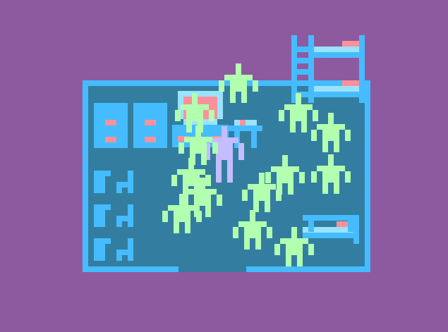

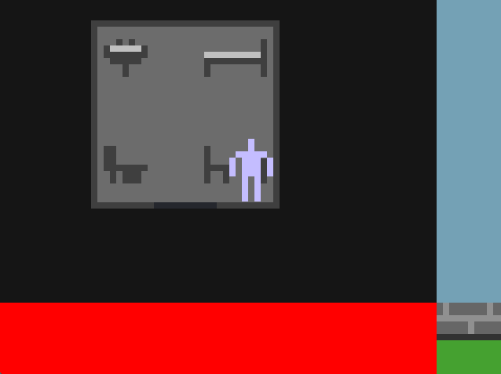

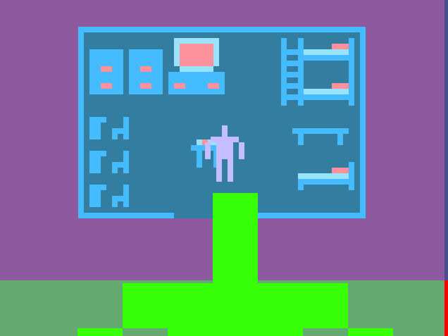

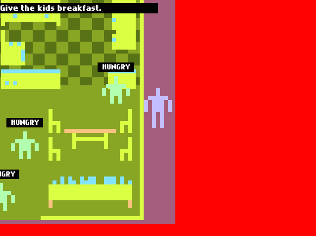

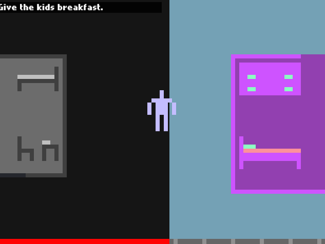

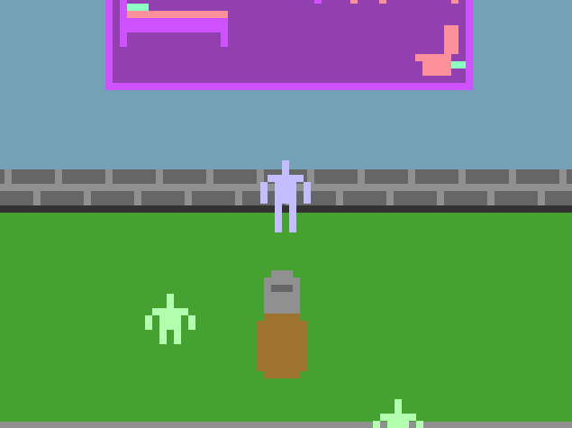

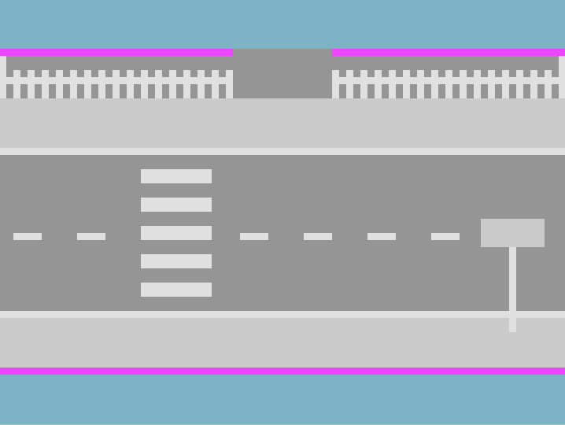

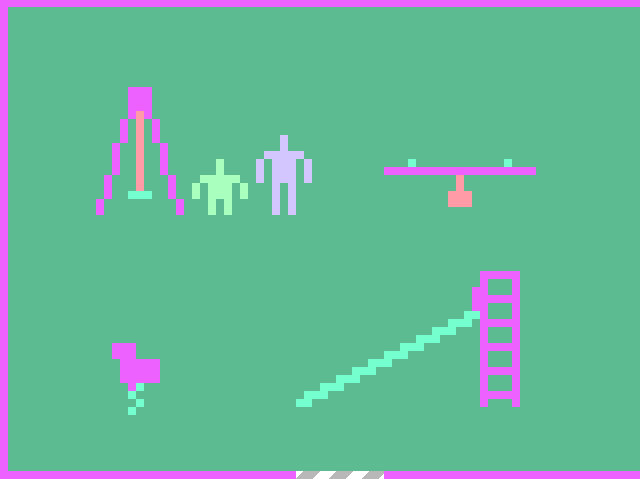

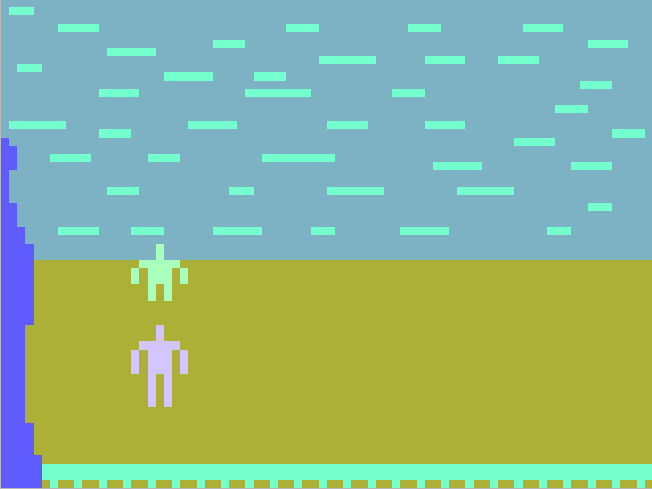

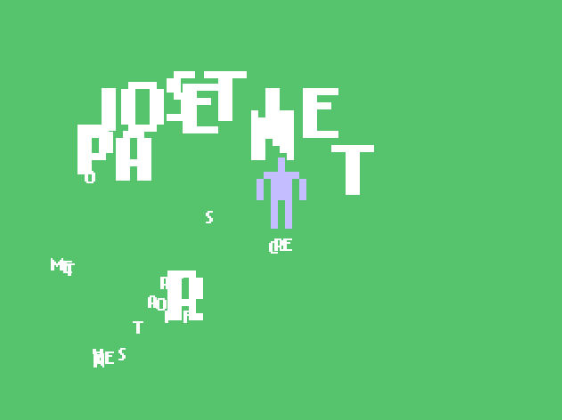

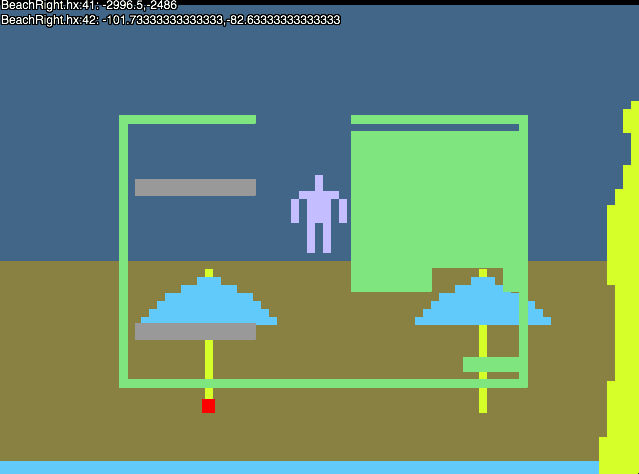

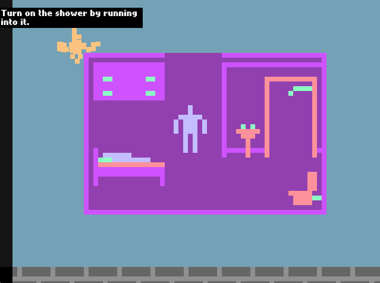

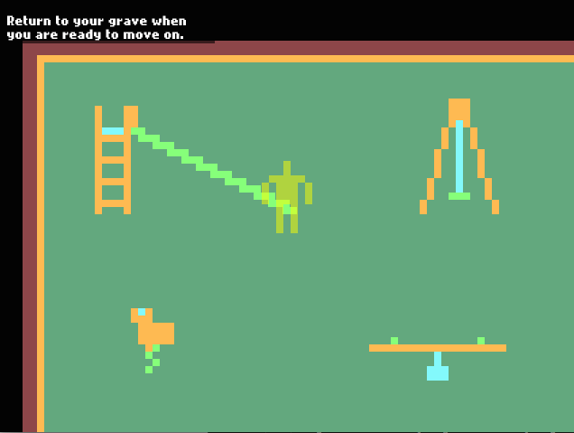

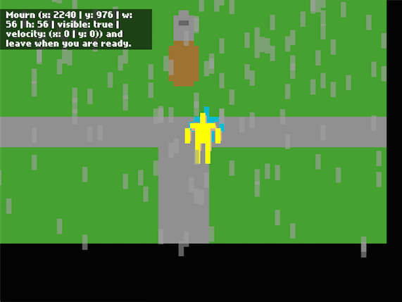

[Car glitch](videos/car.mp4) (.mp4)

[Bus glitch](videos/bus.mp4) (.mp4)
